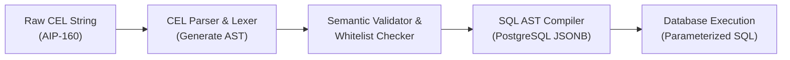
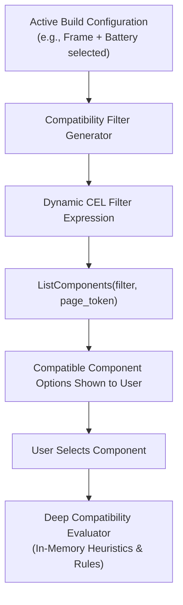

# Component Querying, Filtering, and Pagination Specification

## 1. Overview & Architectural Context

With the Quadsmith platform adopting a **PostgreSQL + JSONB + Protobuf** architecture, all physical drone hardware specifications (Frames, Motors, ESCs, Flight Controllers, etc.) and software profiles are stored within a unified `Component` model in PostgreSQL:

- Base identity attributes (`id`, `name`, `type`, `releaseYear`, `weightG`) reside in first-class relational columns with UUIDv7 primary keys.
- Specialized subtype specifications (e.g., `motor.kvRating`, `frame.wheelbaseMm`, `esc.burstCurrentA`) are modeled as strongly-typed Protobuf contracts (`proto/quadsmith/v1/`) and persisted within the `Component.data` `JSONB` column.

This hybrid storage architecture provides schema agility without DDL migrations for component specifications. However, querying this polymorphic catalog requires a robust, high-performance query layer that can:

1. **Support Rich Filter Expressions:** Allow users, UI configurators, and automated checkers to filter on both root relational columns and deeply nested JSONB specifications.
2. **Enable Declarative Compatibility Pre-Filtering:** Allow the build configurator to translate physical and electrical constraints directly into query filters (e.g., filtering motors that fit a selected frame's mount pattern before presenting options to the user).
3. **Guarantee Deterministic $O(1)$ Pagination:** Scale to hundreds of thousands of parts and community builds without the performance degradation and drift of SQL `OFFSET` pagination.
4. **Prevent SQL Injection & Protect DB Resources:** Compile abstract queries safely into parameterized SQL ASTs without dynamic string concatenation.

To meet these requirements, Quadsmith adopts the **Google AIP-160** filtering standard powered by **CEL (Common Expression Language)** and **Google AIP-158** cursor pagination.

---

## 2. API Contract (Protobuf & AIP Standards)

The external interface adheres to Google API Improvement Proposals ([AIP-158](https://google.aip.dev/158) for pagination, [AIP-160](https://google.aip.dev/160) for filtering, and [AIP-132](https://google.aip.dev/132) for ordering).

Defined in `proto/quadsmith/v1/api.proto`:

```protobuf
syntax = "proto3";

package quadsmith.v1;

import "quadsmith/v1/common.proto";
import "quadsmith/v1/component.proto";

message ListComponentsRequest {
  // Optional filter for top-level component subtype
  ComponentType type = 1;

  // AIP-160 filter expression using Common Expression Language (CEL)
  // Example: 'motor.kv_rating >= 1800 AND "16x16" in motor.mount_patterns'
  string filter = 2;

  // AIP-132 order-by specification (comma-separated list of field names and directions)
  // Example: 'motor.kv_rating desc, name asc'
  string order_by = 3;

  // Maximum items to return per page (Default: 20, Maximum: 100)
  int32 page_size = 4;

  // Opaque keyset cursor token returned from a prior response
  string page_token = 5;
}

message ListComponentsResponse {
  // Ordered page of components
  repeated Component components = 1;

  // Opaque cursor token for retrieving the next page; empty if on the last page
  string next_page_token = 2;

  // Total matching records across the entire dataset (optional, computed on demand)
  int32 total_count = 3;
}
```

---

## 3. Filter Language (AIP-160 & CEL)

### 3.1 Why Common Expression Language (CEL)?

Rather than inventing a proprietary query syntax or exposing SQL/Prisma dialect directly to clients:
- **Standardized & Battle-Tested:** CEL was developed by Google for Kubernetes policies, Firebase rules, and GCP APIs.
- **Non-Turing Complete & Sandboxed:** CEL contains no infinite loops or external system calls, executing deterministically with bounded compute cost.
- **Parsed into an Abstract Syntax Tree (AST):** Clients send human-readable expressions that parse into a strict AST. The backend inspects and validates the AST against a field whitelist before compiling to SQL.
- **Type-Safe:** Expression terms are validated against known Protobuf types (e.g., verifying that `motor.kv_rating` is compared against an integer, not a string).

### 3.2 Supported Syntax & Operator Mapping

| CEL Operator / Function | Meaning | Example Expression | SQL JSONB Equivalent |
|---|---|---|---|
| `=`, `!=` | Equality / Inequality | `motor.stator_size = "2207"` | `data->'motor'->>'statorSize' = $1` |
| `<`, `<=`, `>`, `>=` | Numeric Comparison | `motor.kv_rating >= 1960` | `(data->'motor'->>'kvRating')::int >= $1` |
| `AND`, `&&` | Logical Conjunction | `weight_g < 35 AND motor.kv_rating > 1800` | `... AND ...` |
| `OR`, `\|\|` | Logical Disjunction | `type = "MOTOR" OR type = "ESC"` | `... OR ...` |
| `NOT`, `!` | Negation | `NOT (motor.shaft_type = "M5")` | `NOT (...)` |
| `in` | Array / Set Membership | `"018e123" in frame.fc_stack_mount_ids` | `data->'frame'->'fcStackMountIds' ? $1` |
| `in` | Range / Set Inclusion | `motor.kv_rating in [1750, 1850, 1960]` | `(data->'motor'->>'kvRating')::int = ANY($1)` |
| `startsWith()` | Prefix Text Matching | `name.startsWith("SpeedyBee")` | `name ILIKE $1 \|\| '%'` |
| `:` (Traversal / Has) | Substring / Traversal | `name: "F7"` | `name ILIKE '%' \|\| $1 \|\| '%'` |

### 3.3 Target Field Resolution (Root vs. Subtype)

The compiler parses attribute paths and classifies them into two categories:

1. **Root Relational Fields:** Directly mapped to table columns on `"Component"`:
   - `id`, `name`, `type`, `release_year`, `release_month`, `release_day`, `weight_g`.
2. **Subtype JSONB Fields:** Mapped to nested paths within `Component.data` using Protobuf field mapping:
   - `motor.kv_rating` $\rightarrow$ `(data->'motor'->>'kvRating')::int`
   - `frame.wheelbase_mm` $\rightarrow$ `(data->'frame'->>'wheelbaseMm')::int`
   - `frame.max_prop_size_mm` $\rightarrow$ `(data->'frame'->>'maxPropSizeMm')::float8`
   - `esc.continuous_current_a` $\rightarrow$ `(data->'esc'->>'continuousCurrentA')::float8`
   - `battery.capacity_mah` $\rightarrow$ `(data->'battery'->>'capacityMah')::int`

---

## 4. Query Compilation Pipeline

The translation from a user-supplied CEL string to a secure, executed PostgreSQL query follows a four-stage pipeline:



### 4.1 Pipeline Stages

1. **Lexical Analysis & AST Parsing:**
   The incoming string (e.g., `motor.kv_rating >= 1800 AND "16x16" in motor.mount_pattern_ids`) is parsed into a CEL AST consisting of operator nodes, identifiers, and literals.
2. **Semantic Validation & Whitelist Enforcement:**
   - The validator verifies node depth (maximum AST depth = 10) to prevent denial-of-service via deeply nested expressions.
   - Every identifier must exist in the **Component Field Whitelist**. Unknown fields (e.g., `motor.internal_secret_code`) immediately fail with an `INVALID_ARGUMENT (400)` error.
   - Strict typing ensures literal types match field types (e.g., preventing string comparisons against numeric `kv_rating`).
3. **Parameterized SQL Generation:**
   - Identifiers are transformed into specific PostgreSQL column or JSON extraction clauses.
   - Literals are extracted into parameterized bind variables (`$1`, `$2`, ...). **No literal value is ever concatenated into raw SQL.**
4. **Execution:**
   - The compiled SQL `WHERE` clause is merged with tenant permissions, soft-delete filters (`deleted_at IS NULL`), keyset pagination predicates, and `ORDER BY` clauses.

### 4.2 Concrete Compilation Example

**Client Request:**
```cel
type = "MOTOR" AND motor.kv_rating >= 1800 AND motor.kv_rating <= 2100 AND weight_g < 35.0
```

**Compiled Parameterized SQL:**
```sql
SELECT 
    id, name, type, "releaseYear", "weightG", data
FROM "Component"
WHERE 
    type = $1::"ComponentType"
    AND (data->'motor'->>'kvRating')::int >= $2
    AND (data->'motor'->>'kvRating')::int <= $3
    AND "weightG" < $4
ORDER BY id ASC
LIMIT 21;
```
**Bind Parameters:**
`['MOTOR', 1800, 2100, 35.0]`

---

## 5. Declarative Compatibility Integration

A key architectural advantage of CEL filtering is **Declarative Compatibility Pre-Filtering** in the Build Planner.

### 5.1 Pre-Filtering vs. Deep Evaluation

Quadsmith divides compatibility into two phases:

1. **Declarative Pre-Filtering (Query Layer):** Eliminates impossible candidates at the database level before rendering component pickers (e.g., hiding 6-inch props when viewing parts for a 3-inch frame).
2. **Deep Rule Evaluation (Compatibility Engine):** Evaluates selected components in memory using physics, telemetry heuristics, and electrical calculations (documented in [`docs/compatibility-checker-design.md`](file:///home/roramu/projects/quadsmith/docs/compatibility-checker-design.md)).



### 5.2 Dynamic Filter Generation Rules

When a user is configuring a build, selecting an anchor component generates declarative CEL filters for all subsequent component categories:

#### Rule 1: Frame $\rightarrow$ Motor Compatibility
- **Constraint:** Motor mount pattern must be supported by the frame.
- **Frame Spec:** `motorMountPatternIds = ["018e-mount-16x16", "018e-mount-19x19"]`
- **Generated CEL Filter for Motors:**
  ```cel
  type = "MOTOR" AND (
    "018e-mount-16x16" in motor.mount_pattern_ids OR 
    "018e-mount-19x19" in motor.mount_pattern_ids
  )
  ```

#### Rule 2: Frame $\rightarrow$ Propeller Compatibility
- **Constraint:** Propeller diameter must not exceed frame maximum clearance.
- **Frame Spec:** `maxPropSizeMm = 129.54` (5.1 inches)
- **Generated CEL Filter for Propellers:**
  ```cel
  type = "PROPELLER" AND propeller.diameter_mm <= 129.54
  ```

#### Rule 3: Frame $\rightarrow$ Flight Stack Mounting
- **Constraint:** FC or ESC mount pattern must match frame stack mounting locations.
- **Frame Spec:** `fcStackMountIds = ["018e-mount-20x20", "018e-mount-30.5x30.5"]`
- **Generated CEL Filter for Flight Controllers:**
  ```cel
  type = "FLIGHT_CONTROLLER" AND (
    "018e-mount-20x20" in flight_controller.mount_pattern_ids OR 
    "018e-mount-30.5x30.5" in flight_controller.mount_pattern_ids
  )
  ```

#### Rule 4: Battery $\rightarrow$ ESC Voltage Compatibility
- **Constraint:** ESC must support the maximum pack voltage of the selected battery chemistry and cell count.
- **Battery Spec:** 6S LiPo $\rightarrow$ Max voltage = $6 \times 4.20\text{V} = 25.2\text{V}$
- **Generated CEL Filter for ESCs:**
  ```cel
  type = "ESC" AND esc.input_voltage_max_v >= 25.2
  ```

---

## 6. Sorting & Indexing Strategy

Because specifications are stored in JSONB, un-indexed filtering or sorting would require PostgreSQL to perform full sequential scans and parse JSON objects per row. To achieve sub-millisecond execution, Quadsmith utilizes targeted indexing strategies.

### 6.1 B-Tree Functional / Expression Indexes

For high-cardinality numerical fields frequently targeted for range filtering and sorting, PostgreSQL allows functional B-Tree indexes directly on typed JSON expressions.

To minimize index bloat, these are built as **Partial Indexes** restricted to their specific `ComponentType`:

```sql
-- Fast range queries and sorting on Motor KV Rating
CREATE INDEX idx_component_motor_kv 
ON "Component" (((data->'motor'->>'kvRating')::int))
WHERE type = 'MOTOR';

-- Fast range queries on Frame Prop Clearance
CREATE INDEX idx_component_frame_max_prop 
ON "Component" (((data->'frame'->>'maxPropSizeMm')::float8))
WHERE type = 'FRAME';

-- Fast range queries on ESC Current
CREATE INDEX idx_component_esc_current 
ON "Component" (((data->'esc'->>'continuousCurrentA')::float8))
WHERE type = 'ESC';

-- Fast sorting on base physical weight
CREATE INDEX idx_component_weight 
ON "Component" ("weightG")
WHERE "weightG" IS NOT NULL;
```

### 6.2 GIN (Generalized Inverted Index) for Array Containment

For multi-valued attributes like mounting pattern arrays (`fcStackMountIds`, `motorMountPatternIds`), a GIN index on `Component.data` enables instant membership lookups using the JSONB containment operator (`@>`) or key existence (`?`):

```sql
-- GIN index using jsonb_path_ops for high-performance containment (@>)
CREATE INDEX idx_component_data_gin 
ON "Component" 
USING gin (data jsonb_path_ops);
```

**Query taking advantage of GIN index:**
```sql
-- Checks if the motor's mount pattern list contains the required mount ID
SELECT * FROM "Component"
WHERE type = 'MOTOR'
  AND data @> '{"motor": {"mountPatternIds": ["018e-mount-16x16"]}}'::jsonb;
```

### 6.3 Full-Text & Prefix Search

Catalog searches on component names leverage PostgreSQL's `pg_trgm` extension for fast substring and prefix matching:

```sql
CREATE EXTENSION IF NOT EXISTS pg_trgm;

CREATE INDEX idx_component_name_trgm 
ON "Component" 
USING gin (name gin_trgm_ops);
```

---

## 7. Keyset / Cursor-Based Pagination (AIP-158)

### 7.1 Why Keyset Pagination Instead of `OFFSET`?

Traditional `LIMIT / OFFSET` pagination suffers from two fatal flaws:
1. **$O(N)$ Performance Degradation:** `OFFSET 10000` forces the database to read and discard 10,000 rows before returning results.
2. **Result Drift:** If an item is inserted or deleted while a user is paginating, rows shift between pages, causing duplicate or missed items.

Quadsmith strictly enforces **Keyset (Cursor-Based) Pagination**.

### 7.2 Leveraging UUIDv7 for Natural Ordering

Quadsmith entities use **UUIDv7** primary keys. UUIDv7 embeds a 48-bit millisecond Unix timestamp in its most significant bits:

```text
 0                   1                   2                   3
 0 1 2 3 4 5 6 7 8 9 0 1 2 3 4 5 6 7 8 9 0 1 2 3 4 5 6 7 8 9 0 1
+-+-+-+-+-+-+-+-+-+-+-+-+-+-+-+-+-+-+-+-+-+-+-+-+-+-+-+-+-+-+-+-+
|                           unix_ts_ms                          |
+-+-+-+-+-+-+-+-+-+-+-+-+-+-+-+-+-+-+-+-+-+-+-+-+-+-+-+-+-+-+-+-+
|          unix_ts_ms           |  ver  |       rand_a          |
+-+-+-+-+-+-+-+-+-+-+-+-+-+-+-+-+-+-+-+-+-+-+-+-+-+-+-+-+-+-+-+-+
|var|                        rand_b                             |
+-+-+-+-+-+-+-+-+-+-+-+-+-+-+-+-+-+-+-+-+-+-+-+-+-+-+-+-+-+-+-+-+
|                            rand_b                             |
+-+-+-+-+-+-+-+-+-+-+-+-+-+-+-+-+-+-+-+-+-+-+-+-+-+-+-+-+-+-+-+-+
```

Because UUIDv7 IDs are naturally time-ordered and unique, default pagination requires no secondary sort column:
```sql
-- Fetch first page
SELECT * FROM "Component"
WHERE type = 'MOTOR'
ORDER BY id ASC
LIMIT 21;

-- Fetch next page using last seen ID as cursor
SELECT * FROM "Component"
WHERE type = 'MOTOR'
  AND id > '018e3a2b-9c40-7000-8000-123456789abc'
ORDER BY id ASC
LIMIT 21;
```

### 7.3 Multi-Column Sorting with Composite Keyset Cursors

When the client requests a custom sort order via `order_by` (e.g. `order_by = "weight_g desc"` or `order_by = "motor.kv_rating asc"`), sorting by a non-unique column alone causes nondeterministic pagination if multiple items share identical values.

To ensure deterministic order, the query engine always appends `id` as the final tie-breaker:
`ORDER BY sort_column [ASC|DESC], id [ASC|DESC]`.

#### Cursor Encoding
The opaque `page_token` encodes a JSON payload containing the last seen sort value and the tie-breaker `id`:

```json
// Plaintext cursor payload
{
  "v": 32.5,
  "id": "018e3a2b-9c40-7000-8000-123456789abc"
}
```
*Encoded token:* `eyJ2IjozMi41LCJpZCI6IjAxOGUzYTJiLTljNDAtNzAwMC04MDAwLTEyMzQ1Njc4OWFiYyJ9`

#### SQL Keyset Predicate Compilation
Using PostgreSQL row-value comparison syntax:

**For Ascending Order (`weight_g ASC, id ASC`):**
```sql
WHERE ("weightG", id) > ($cursor_v, $cursor_id)
ORDER BY "weightG" ASC, id ASC
LIMIT 21;
```

**For Descending Order (`weight_g DESC, id DESC`):**
```sql
WHERE ("weightG", id) < ($cursor_v, $cursor_id)
ORDER BY "weightG" DESC, id DESC
LIMIT 21;
```

**Handling Null Values in Keyset:**
Nullable columns are sorted with `NULLS LAST`. If the cursor value is `NULL`, the query switches to fetching remaining `NULL` values filtered strictly by `id > $cursor_id`.

### 7.4 Determining `next_page_token` Without `COUNT(*)`

To avoid expensive total table counts:
1. The server requests `LIMIT page_size + 1` (e.g., requesting 21 rows for a page size of 20).
2. If 21 rows are returned:
   - Rows 1–20 are returned in `ListComponentsResponse.components`.
   - Row 20's values are encoded into `next_page_token`.
   - The 21st row is dropped.
3. If $\le 20$ rows are returned:
   - All rows are returned.
   - `next_page_token` is set to empty string `""`, indicating the last page.

---

## 8. Whitelist Schema Definition & Security Guardrails

To prevent SQL injection, information disclosure, and resource exhaustion, all query fields are strictly validated against a declarative schema definition.

### 8.1 Schema Whitelist Registry

```typescript
export interface FieldDefinition {
  type: 'STRING' | 'INT' | 'FLOAT' | 'BOOLEAN' | 'ARRAY_STRING';
  sqlTarget: string; // Target SQL column or JSONB accessor
  cast?: string;     // Explicit SQL cast (e.g. 'int', 'float8')
}

export const COMPONENT_QUERY_WHITELIST: Record<string, FieldDefinition> = {
  // Base Relational Fields
  'id': { type: 'STRING', sqlTarget: '"Component"."id"' },
  'name': { type: 'STRING', sqlTarget: '"Component"."name"' },
  'type': { type: 'STRING', sqlTarget: '"Component"."type"', cast: '"ComponentType"' },
  'release_year': { type: 'INT', sqlTarget: '"Component"."releaseYear"', cast: 'int' },
  'weight_g': { type: 'FLOAT', sqlTarget: '"Component"."weightG"', cast: 'float8' },

  // Motor Subtype Fields
  'motor.stator_size': { type: 'STRING', sqlTarget: "data->'motor'->>'statorSize'" },
  'motor.kv_rating': { type: 'INT', sqlTarget: "data->'motor'->>'kvRating'", cast: 'int' },
  'motor.input_voltage_min_v': { type: 'FLOAT', sqlTarget: "data->'motor'->>'inputVoltageMinV'", cast: 'float8' },
  'motor.input_voltage_max_v': { type: 'FLOAT', sqlTarget: "data->'motor'->>'inputVoltageMaxV'", cast: 'float8' },
  'motor.mount_pattern_ids': { type: 'ARRAY_STRING', sqlTarget: "data->'motor'->'mountPatternIds'" },
  'motor.shaft_type': { type: 'STRING', sqlTarget: "data->'motor'->>'shaftType'" },

  // Frame Subtype Fields
  'frame.wheelbase_mm': { type: 'INT', sqlTarget: "data->'frame'->>'wheelbaseMm'", cast: 'int' },
  'frame.max_prop_size_mm': { type: 'FLOAT', sqlTarget: "data->'frame'->>'maxPropSizeMm'", cast: 'float8' },
  'frame.fc_stack_mount_ids': { type: 'ARRAY_STRING', sqlTarget: "data->'frame'->'fcStackMountIds'" },
  'frame.motor_mount_pattern_ids': { type: 'ARRAY_STRING', sqlTarget: "data->'frame'->'motorMountPatternIds'" },
  'frame.camera_mount_width_mm': { type: 'FLOAT', sqlTarget: "data->'frame'->>'cameraMountWidthMm'", cast: 'float8' },

  // Propeller Subtype Fields
  'propeller.diameter_mm': { type: 'FLOAT', sqlTarget: "data->'propeller'->>'diameterMm'", cast: 'float8' },
  'propeller.pitch_mm': { type: 'FLOAT', sqlTarget: "data->'propeller'->>'pitchMm'", cast: 'float8' },
  'propeller.blade_count': { type: 'INT', sqlTarget: "data->'propeller'->>'bladeCount'", cast: 'int' },

  // ESC Subtype Fields
  'esc.continuous_current_a': { type: 'FLOAT', sqlTarget: "data->'esc'->>'continuousCurrentA'", cast: 'float8' },
  'esc.burst_current_a': { type: 'FLOAT', sqlTarget: "data->'esc'->>'burstCurrentA'", cast: 'float8' },
  'esc.input_voltage_max_v': { type: 'FLOAT', sqlTarget: "data->'esc'->>'inputVoltageMaxV'", cast: 'float8' },

  // Flight Controller Subtype Fields
  'flight_controller.mcu_processor': { type: 'STRING', sqlTarget: "data->'flightController'->>'mcuProcessor'" },
  'flight_controller.input_voltage_max_v': { type: 'FLOAT', sqlTarget: "data->'flightController'->>'inputVoltageMaxV'", cast: 'float8' },
  'flight_controller.mount_pattern_ids': { type: 'ARRAY_STRING', sqlTarget: "data->'flightController'->'mountPatternIds'" },

  // Battery Subtype Fields
  'battery.capacity_mah': { type: 'INT', sqlTarget: "data->'battery'->>'capacityMah'", cast: 'int' },
  'battery.cell_count': { type: 'INT', sqlTarget: "data->'battery'->>'cellCount'", cast: 'int' },
  'battery.c_rating_continuous': { type: 'FLOAT', sqlTarget: "data->'battery'->>'cRatingContinuous'", cast: 'float8' }
};
```

### 8.2 Security Guardrails & Limits

| Threat / Risk | Mitigation Strategy |
|---|---|
| **SQL Injection** | No raw SQL concatenation. All field names must match the whitelist. All literals are bound to numbered positional parameters (`$1, $2`). |
| **Denial of Service (Deep AST)** | The CEL parser limits expression complexity: AST depth $\le 10$, total AST nodes $\le 50$. |
| **Expensive Scans (`COUNT(*)`)** | Omit total count by default. Keyset fetches `LIMIT + 1`. If `total_count` is explicitly requested, it is served via `reltuples` approximation or cached Redis counts. |
| **Unindexed Sort Starvation** | Sort fields in `order_by` are restricted to indexed attributes (`id`, `weight_g`, `release_year`, and functional indexed JSONB fields). Unindexed sort requests are rejected. |
| **Memory Exhaustion** | Enforce hard ceiling on `page_size` ($\max = 100$). |

---

## 9. Performance Benchmarks & Targets

For a production catalog containing 100,000 components and 500,000 build records, the query system is designed to meet the following service-level objectives (SLOs):

| Operation Type | Query Mechanism | Target p95 Latency | Target p99 Latency |
|---|---|---|---|
| **Default List / Keyset Next Page** | B-Tree index scan on `id` (UUIDv7) | $< 5\text{ ms}$ | $< 12\text{ ms}$ |
| **Filtered Subtype Query (Indexed)** | Functional B-Tree index scan (e.g. `idx_component_motor_kv`) | $< 8\text{ ms}$ | $< 20\text{ ms}$ |
| **Array Containment / Mount Match** | GIN index scan (`idx_component_data_gin`) | $< 12\text{ ms}$ | $< 25\text{ ms}$ |
| **Full-Text Component Search** | Trigram GIN index scan (`idx_component_name_trgm`) | $< 15\text{ ms}$ | $< 35\text{ ms}$ |
| **CEL AST Parsing & Validation** | In-memory compiled TypeScript / V8 | $< 0.5\text{ ms}$ | $< 1.0\text{ ms}$ |

---

## 10. Summary

The sorting, filtering, and pagination architecture bridges the flexibility of Protobuf-defined JSONB documents with the relational reliability and speed of PostgreSQL:

1. **AIP-160 / CEL Filtering:** Provides an industry-standard, sandbox-safe query language for users, API consumers, and frontend builders.
2. **Safe SQL Compilation:** Validates ASTs against a strict field whitelist and emits fully parameterized SQL, eliminating SQL injection.
3. **Declarative Compatibility:** Transforms build configuration rules into dynamic query filters, enabling instant compatibility filtering at the database layer.
4. **$O(1)$ Keyset Pagination:** Harnesses UUIDv7's time-ordered structure and composite keyset cursors for drift-free, constant-time pagination across datasets of any size.
