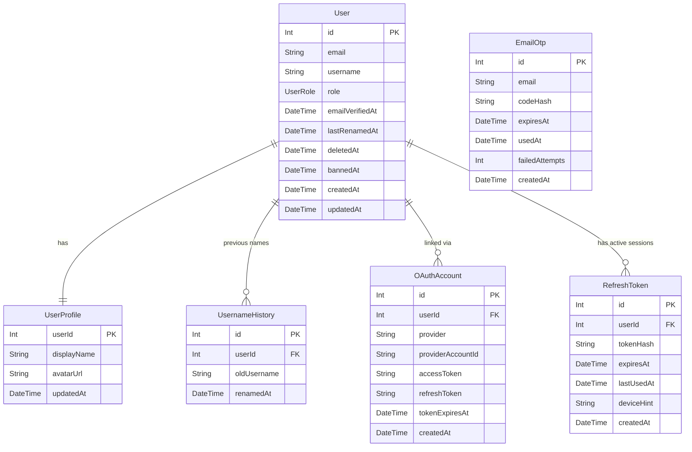

# User Table & Authentication Design

## Summary of Decisions

| Decision | Choice |
|---|---|
| User purpose | Manage builds + contribute to catalog; favorites, comments, upvotes, edit suggestions |
| Auth methods | Email OTP + OAuth providers |
| OAuth providers | Google, GitHub, Discord, Microsoft/Azure AD (Meta to consider) |
| Profile import | Pull displayName + avatarUrl from OAuth provider at signup |
| Roles | `ADMIN`, `USER` (moderator can be added later when needed) |
| Email verification | Required before any write operation |
| Session strategy | Hybrid: short-lived JWT (1h) + long-lived refresh token in DB (30 days) |
| Account deletion | Soft-delete with `deletedAt` timestamp; appears as `[Deleted User]` to clients |
| Account ban | `bannedAt` timestamp; appears identical to deletion to clients; blocks resurrection until cleared by mod/admin |
| User ID type | Sequential integer (`autoincrement()`); never exposed to clients |
| Public user identifier | `username` — used in all URLs and API responses instead of ID |
| Username renames | Allowed; rate-limited once per 30 days |
| Old username hold | 30-day redirect window (same timeframe as rename limit), then released |
| Username hold on delete/ban | Same 30-day hold via `UsernameHistory` row written at delete/ban time |
| Locale/timezone | Not stored; always UTC in DB, client handles display |
| Table structure | Split: `User` (auth) + `UserProfile` (public display data) |
| Email identity merging | Accounts with the same verified email are auto-merged across providers |
| Account resurrection | Re-registering with same email undeletes the row; blocked if `bannedAt` is set |

---

## Authentication Flows

### 1. Email OTP

**Sign-up / Sign-in flow:**
1. User submits their email address.
2. A 6-digit OTP is generated, hashed, and stored in an `EmailOtp` row. The plaintext code is emailed to the user.
3. User types the code into the app (no context switch — they stay on the page).
4. Server validates the code: not expired (3 min TTL), not already used, not exhausted by failed attempts.
5. On success: mark `usedAt`, then check if a `User` row exists for this email.
   - **Exists, not deleted/banned:** log in, issue tokens.
   - **Exists, soft-deleted (`deletedAt` set, `bannedAt` null):** undelete the row (clear `deletedAt`), log in — account resurrection.
   - **Exists, banned (`bannedAt` set):** reject — "this account has been suspended."
   - **Does not exist:** create a new `User` + `UserProfile`, set `emailVerifiedAt`, log in.
6. Issue a DB-stored refresh token (30-day TTL) + short-lived JWT access token (1h).

**Two-tier throttling (no lockout field needed — fully computed):**
- **Tier 1 — per code:** 3 failed attempts → code is exhausted, `failedAttempts = 3`. User must request a new code.
- **Tier 2 — per email/hour:** count `EmailOtp` rows for this email where `failedAttempts >= 3` AND `createdAt > NOW() - 1 hour`. If count ≥ 3 → locked. Block both new code requests and verification attempts.
- **Reset:** a successful login clears the burned-code history (or simply: once the 1-hour window passes, the count drops back to zero naturally).

> [!NOTE]
> The lockout state is derived entirely from existing `EmailOtp` rows — no `lockedUntil` column needed. Expired rows older than 1 hour can be pruned by a cleanup job without affecting lockout logic.

> [!IMPORTANT]
> The OTP code itself must be stored as an Argon2/bcrypt hash. A DB breach must not expose usable codes.

---

### 2. OAuth (Google, GitHub, Discord, Microsoft, [Meta])

**Sign-up / Sign-in flow:**
1. User clicks "Sign in with X" → redirected to provider's OAuth consent screen.
2. Provider redirects back with an authorization code.
3. Server exchanges code for an access token + profile data (email, name, avatar).
4. Server looks up `OAuthAccount` by `(provider, providerAccountId)`.
   - **Found:** log in the linked `User`.
   - **Not found, email matches existing `User`:** auto-link this provider to the existing account (merge on email) and log in.
   - **Not found, no email match:** create a new `User` + `UserProfile` (pre-populated from provider data) + `OAuthAccount` row.
5. `emailVerifiedAt` is set to now (provider email is considered pre-verified).
6. Issue refresh token (DB) + JWT access token (1h).

> [!IMPORTANT]
> Store OAuth access/refresh tokens encrypted at rest. They grant API access to the provider on behalf of the user.

---

### 3. Session Strategy: Hybrid JWT + DB Refresh Token

**Access token (JWT, 1h TTL):**
- Signed by server secret; verified by signature alone — no DB hit on every request.
- Contains: `userId`, `role`, `refreshTokenId` (ties it to the refresh token row).
- Not stored in DB.

**Refresh token (DB-stored, 30-day TTL):**
- Opaque random 256-bit string, stored as a hash in DB.
- Used only to issue new access tokens at `/auth/refresh`.
- Revocable instantly — delete the row → user must re-login after current JWT expires (max 1h).
- One row per active device/session.

**Forced logout / ban:**
- Delete all `RefreshToken` rows for a user → they cannot renew access after their current JWT expires (at most 1h).

---

## Proposed Schema

### `User` (auth-only, kept lean)

| Column | Type | Notes |
|---|---|---|
| `id` | `Int` (`autoincrement()`) | PK; internal only, never exposed to clients |
| `email` | `String` | Unique, normalized to lowercase |
| `username` | `String` | Unique, URL-safe, public handle (e.g. `@roramu`) |
| `role` | `UserRole` enum | `USER`, `ADMIN` |
| `emailVerifiedAt` | `DateTime?` | Null = unverified; set on first successful OTP/OAuth verification |
| `lastRenamedAt` | `DateTime?` | Used to enforce 30-day rename rate limit |
| `deletedAt` | `DateTime?` | Soft-delete; set by user action; cleared on resurrection |
| `bannedAt` | `DateTime?` | Set by mod/admin; blocks resurrection until cleared |
| `createdAt` | `DateTime` | `@default(now())` |
| `updatedAt` | `DateTime` | `@updatedAt` |

> [!NOTE]
> Client-facing anonymization rule: return `[Deleted User]` whenever `deletedAt IS NOT NULL OR bannedAt IS NOT NULL`. Resurrection is only allowed when `bannedAt IS NULL`.

### `UsernameHistory` (tracks vacated names during 30-day hold window)

| Column | Type | Notes |
|---|---|---|
| `id` | `Int` (`autoincrement()`) | PK |
| `userId` | `Int` | FK → User |
| `oldUsername` | `String` | The name that was vacated |
| `renamedAt` | `DateTime` | `@default(now())` — hold expires 30 days after this |

`@@index([oldUsername, renamedAt])` — for fast redirect and availability lookups

> [!NOTE]
> **Availability check:** name must not appear in `User.username` (current names) AND must not appear in `UsernameHistory.oldUsername` WHERE `renamedAt > NOW() - 30 days` (in hold window).
> **URL resolution:** check `User.username` first → if not found, check `UsernameHistory` for a live redirect (30-day window) → else 404.
> **On delete or ban:** write a `UsernameHistory` row for the vacated username, same as a rename.

### `UserProfile` (public display data, 1:1 with User)

| Column | Type | Notes |
|---|---|---|
| `userId` | `Int` | PK, FK → User (cascade delete) |
| `displayName` | `String` | Editable; pre-populated from OAuth provider at signup |
| `avatarUrl` | `String?` | Editable; pre-populated from OAuth provider at signup |
| `updatedAt` | `DateTime` | `@updatedAt` |

### `OAuthAccount` (one row per provider per user)

| Column | Type | Notes |
|---|---|---|
| `id` | `Int` (`autoincrement()`) | PK |
| `userId` | `Int` | FK → User |
| `provider` | `OAuthProvider` enum | `GOOGLE`, `GITHUB`, `DISCORD`, `MICROSOFT`, `META` |
| `providerAccountId` | `String` | The user's ID at the provider |
| `accessToken` | `String?` | Encrypted at rest |
| `refreshToken` | `String?` | Encrypted at rest |
| `tokenExpiresAt` | `DateTime?` | |
| `createdAt` | `DateTime` | `@default(now())` |

`@@unique([provider, providerAccountId])`

### `EmailOtp`

| Column | Type | Notes |
|---|---|---|
| `id` | `Int` (`autoincrement()`) | PK |
| `email` | `String` | Address the code was sent to |
| `codeHash` | `String` | Argon2/bcrypt hash of the 6-digit code |
| `expiresAt` | `DateTime` | 3 minutes from creation |
| `usedAt` | `DateTime?` | Set on successful verification; null = not yet used |
| `failedAttempts` | `Int` | `@default(0)`; code exhausted when ≥ 3 |
| `createdAt` | `DateTime` | `@default(now())` |

`@@index([email, createdAt])` — for tier-2 throttle count query

### `RefreshToken`

| Column | Type | Notes |
|---|---|---|
| `id` | `Int` (`autoincrement()`) | PK |
| `userId` | `Int` | FK → User |
| `tokenHash` | `String` | Hash of the actual 256-bit opaque token |
| `expiresAt` | `DateTime` | 30 days from issuance |
| `lastUsedAt` | `DateTime?` | Updated on each `/auth/refresh` call |
| `deviceHint` | `String?` | Optional user-agent snippet for "My Sessions" UI |
| `createdAt` | `DateTime` | `@default(now())` |

---

## Entity Relationships

---

## Future Tables (referenced by User, not designed yet)

These will need `userId` FKs added when implemented:

| Feature | Table(s) |
|---|---|
| Builds owned by a user | `Build.userId` |
| Favorites (components & builds) | `UserFavorite { userId, targetType, targetId }` |
| Comments + replies + upvotes | `Comment`, `CommentVote` |
| Edit suggestions on component fields | `FieldEditSuggestion { userId, componentId, fieldName, suggestedValue, status }` |

---

## Open Questions / Deferred

- **Meta (Facebook) OAuth** — confirmed as a candidate; needs app registration. Add `META` to the `OAuthProvider` enum when ready.
- **OTP cleanup job** — expired `EmailOtp` rows older than 1 hour can be safely pruned (they no longer affect throttle logic). Implement as a scheduled job at the infrastructure layer; no schema impact.
- **"My Sessions" UI** — `deviceHint` in `RefreshToken` supports showing active sessions to users, but the UI is out of scope for the schema work.
- **Temporary bans** — `bannedAt` captures when a ban was issued but not an expiry. A future `Ban` table (with `reason`, `bannedBy`, `expiresAt`) could support time-limited bans and audit history without changing the core auth logic.
